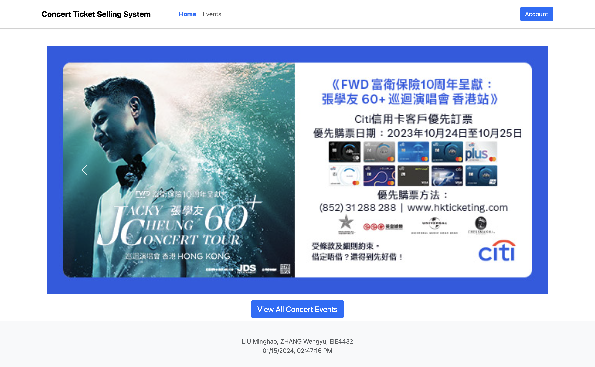
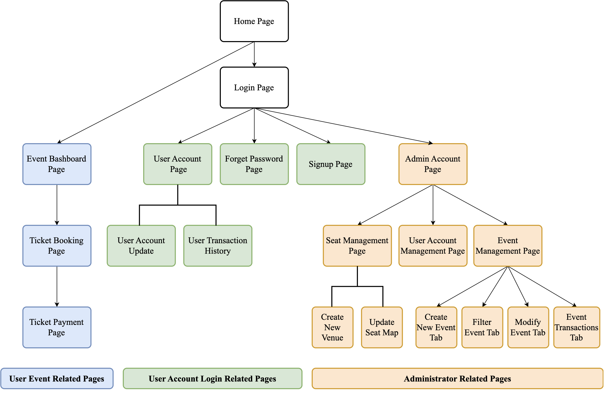
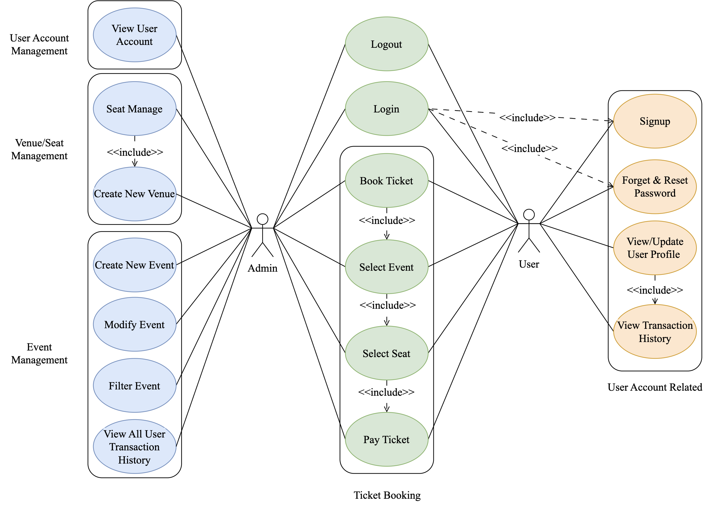

> [!CAUTION]
> ***Please carefully read the [Disclaimer of Liability](#disclaimer-of-liability) below first.***  
> All materials in this archive are for reference only. The actual one may vary. 

# Concert_Ticket_Selling_System

> *A Group Project of Web Systems and Technologies (EIE4432) subject at [The Hong Kong Polytechnic University](https://www.polyu.edu.hk/), made by [LIU Minghao](https://github.com/David-Lmh) and [ZHANG Wengyu](https://github.com/zhangwengyu999)*, 2023/2024 Semester 1.

## Group Members

- [LIU Minghao](https://github.com/David-Lmh)  
- [ZHANG Wengyu](https://github.com/zhangwengyu999)

---

## Demo

### 1. Home page

<center></center>

### 2. Demo website

[https://concert-ticket-selling-system.vercel.app/?authkey=eie4432davidmike](https://concert-ticket-selling-system.vercel.app/?authkey=eie4432davidmike)

- Demo **user** account: `user1`, password: `User1234`
- Demo **admin** account: `admin`, password: `adminpass`

### 3. Demo video

https://github.com/zhangwengyu999/Concert_Ticket_Selling_System/assets/68627255/9c2e161f-87b2-4a99-a592-326acabbab2d

---

## 1. Introduction

In this project, we build a Concert Ticket Selling System, which offers a user-friendly website where Admin can create, filter, modify concert events, set ticket classes and prices, and monitor ticket sales and transactions. Admin can also create venues, modify their seat maps, and view seat information associated users. Admin is able to view all user account information and account activities as well.

User is able to login, register a account, perform forget-password on account and view, update their account information.

Users can view, filter and search on corresponding concert event information, select desired tickets and seats through an interactive map, make online payments, and receive electronic tickets.

The implemented Concert Ticket Selling System can be access from the URL [https://concert-ticket-selling-system.vercel.app/?authkey=eie4432davidmike](https://concert-ticket-selling-system.vercel.app/?authkey=eie4432davidmike)

---

## 2. Tech Stack

Frontend | Backend Infrastructure | Backend Database | Hosting Service
:-: | :-: | :-: | :-:
Bootstrap | Node.js | NoSQL (MongoDB) | Vercel
jQuery | Express.js
JavaScript | 

---

## 3. Website Structure

<center>

</center>

---

## 4. Use Case Diagram

<center>

</center>

---

## 5. Application Features

### 5.1 Basic Features
Category | Deliverable
:-: | ---
User Account Registration | User registration page: support standard information including user ID, password, nickname, email, gender, birthdate, etc.
|| Validation checks for input value, i.e., Password Policy and Duplicate User ID
|| Feedback message on validation failure and registration success/failure 
|| Password stored in a database with password hashing 
|| An admin doesn’t need to register an account.
User Login | Two roles: admin and users 
|| Use user ID and password to log in. The admin uses the default ID "admin” and password "adminpass” to log in.
|| User logout
Event Dashboard | Show the list of events with event details (date/time, title, venue, Dashboard description) 
|| At least one event
|| Ticket sales for each event (Real-time ticket availability)
Ticket Booking Page | Select seats from the SVG seat map
|| View available and occupied seats in the SVG-based seat map (use different colors)   
|| Real-time price calculation
Payment Page | Show event details, seat selection and total price
|| Input payment details (details could be fake)
|| Feedback on payment status
|| Show electronic tickets to buyers after successful purchase
|| Update the order status upon successful payment
Seat Management Page (Admin only) | Create SVG-based seat maps (at least 40 seats) for all venues
|| View current available and occupied seats in the SVG-based seat map (use different colors) 
|| All seats with the same price
Event Manageme nt Page (Admin only) | Create new events (date/time, title, venue, description)

### 5.2 Credit Features
Category | Deliverable
:-: | ---
User Account Registration | User registration page: support profile image on top of other standard information.
User Login | Choice to remember login user-id
||Forget password feature
||The user will be automatically logged out after a certain period of idle time
User Account Management | View user profile
|| Update user profile, including nickname, password, email and profile image
Event Dashboard | Show the list of events with event details (date/time, title, venue, description, plus cover image)
|| At least two events
|| Filter events by date/time, title, venue, description with search function
|| Real-time event name suggestion while searching (like Google auto-complete predictions)
Transaction History | Show the entire transaction history with ticket information and price
Seat Management Page (Admin only) | Modify SVG-based seat maps for all venues 
|| At least two categories of price for all seats, e.g. economy price and first-class price for flight tickets
Event Management Page (Admin only) | Create new events (add cover image on top of date/time, title, venue, and description)
|| Filter events by date/time, title, venue, description with search function
|| Modify existing events (date/time, title, venue, description, cover image)
|| List all users’ transaction history with ticket information and price for each event

### 5.3 Advanced Features
Category | Deliverable
:-: | ---
User Account Management | View other user account information (Admin only)
|| Track and log user account activities, such as login attempts, profile edits, and password changes (Both admin and user)
Seat Management Page (Admin only) | Interactive SVG-based seat map (show the associated user who bought the seat when clicking/hovering the seat)
Event Management Page (Admin only) | Support **cancelling** or rescheduling of events (need to notify the ticket holder via user dashboard)

---

## 6. Database Design

#### 6.1 `users` collection

Column Name | Description 
:-: | ---
`username` (PK) | The unique key to identify a user
`birthDate` | The birth date of the user
`email` | The email of the user
`enabled` | Whether the user is enabled (`true`/`false`)
`gender` | The gender of the user
`image` | The image path of the user profile image
`nickname` | The nickname of the user
`password` | The hashed password of the user
`role` | The role of the account, `user`/`admin`
`transactions` | The transaction array of the user {`eventID` (FK): The event ID of the transaction, `time`: The time of the transaction, `seatCoord` [x, y]: The seat coordinate of the transaction, `price`: The price of the transaction}
`loginAttempts` | The login attempts of the user
`passwordChangeAttempts` | The password change attempts of the user
`profileChangeAttempts` | The profile change attempts of the user

<br>

**`user` collection Data Model Diagram**

```json
{
  _id: <ObjectId1>,
  username: "user1",
  birthDate: "01-2023",
  email: "demouser1@xxx.com",
  enabled: true,
  gender: "male",
  image: "static/uploads/image-1701158141564.png",
  nickname: "u1demo",
  password: "bd5cf8347e036cabe6cd37323186a02ef6c3589d19daaee31eeb2ae3b1507ebe",
  role: "user",
  transactions: [
    {
      eventID: 0,
      time: "2023-11-25T07:32:16.104Z",
      seatCoord: [0,0],
      price: 780
    },
  ],
  loginAttempts: 41,
  passwordChangeAttempts: 3,
  profileChangeAttempts: 4
}
```

#### 6.2 `events` collection

Column Name | Description
:-: | ---
`eventID` (PK) | The unique key to identify an event
`datetime` | The date and time of the event
`title` | The title of the event
`venueID` (FK) | The venue ID of the event
`description` | The description of the event
`image` | The image path of the event
`prices` | The price array of the event, [first class price, second class price]
`status` | The status of the event, `0` for cancelled, `1` for running

<br>

**`events` collection Data Model Diagram**

```json
{
  _id: <ObjectId1>,
  eventID: 0,
  datetime: "Sun 12 Nov 2023 8:15PM",
  title: "Stephy [Therefore I Am] 2023",
  venueID: 0,
  description: "After walking a long way...",
  image: "static/uploads/image-1700914125407.jpg",
  prices: [780, 480],
  status: 1
}
```

#### 6.3 `venues` collection

Column Name | Description
:-: | ---
`venueID` (PK) | The unique key to identify a venue
`venueName` | The name of the venue
`seatMap` | The seat map of the venue. A 2D array, `0` for available, `1` for occupied

<br>

**`venues` collection Data Model Diagram**

```json
{
  _id: <ObjectId1>,
  venueID: 0,
  venueName: "Hall 5BC, Hong Kong Convention and Exhibition Centre, Wanchai",
  seatMap: [
    [1,0,...],
    [0,0,...],
    ...
  ]
}
```

---

## 7. API Specification & Implementation

Totally, the system has 6 routers, including `auth`, `account`, `events`, `venues`, `user`, `order`.

API specification is about which route is doing what functions. You should describe the function, input/output, and the brief algorithm to do that.

### 7.1 `auth` router

**POST `auth/login`**
- Input: `username`, `password`
- Output: 
  - `{ "status": "failed", "reason": "User `" + username + "` is disabled" }`
  - `{ status: "success", user:{username: username, role: user.role} }`
  - `{ "status": "failed", "reason": "Incorrect username and password" }`
- Brief Algorithm: 
  1. Check if the user exists in the database
  2. If the user exists, increment the login attempts
  3. Check if the password is correct
  4. Check if the user is enabled
  5. Return the result in each case

**POST `/auth/register`**
- **Input**: `username`, `password`, `nickname`, `email`, `gender`, `birthDate`, `image`
- **Output**:
  - `{ status: 'failed', message: 'Username must be at least 3 characters' }` for short username.
  - `{ status: 'failed', message: 'Username [username] already exists' }` for existing username.
  - `{ status: 'failed', message: 'Password must be at least 8 characters' }` for short password.
  - `{ status: 'success', user: { username: username, role: role } }` on successful registration.
  - `{ status: 'failed', message: 'Missing fields' }` for missing mandatory fields.
- **Brief Algorithm**:
  1. Validate provided username and password for length constraints.
  2. Check if username already exists in the database.
  3. Create a new user in the database with provided details.
  4. Return the appropriate response based on the operation's success or failure.

**POST `/auth/logout`**
- **Input**: void
- **Output**:
  - `{ status: "failed", message: "Unauthorized" }` if not logged in.
  - Clear the session if logged in.
- **Brief Algorithm**:
  1. Check if the user is currently logged in based on the session data.
  2. If logged in, end the session and clear session data.
  3. Respond with appropriate message based on the user's login status.

**GET `/auth/me`**
- **Input**: void
- **Output**:
  - `{ "status": "success", "user": { "username": [username], "role": [role] } }` if logged in.
  - `{ status: "failed", message: "Unauthorized" }` if not logged in or user has logged in for more than 10 minutes.
- **Brief Algorithm**:
  1. Check if the user is currently logged in based on the session data.
  2. Check if the user has logged in for more than 10 minutes, by comparing the current time with the last login time stored in the session.
  3. Return the logged-in user's username and role if logged in and not timed out.
  4. Respond with an unauthorized message if not logged in or logged in for more than 10 minutes.

---

### 7.2 `account` router

**GET `/account`**
- **Input**: None (uses session data)
- **Output**:
  - Redirects to `/account-page.html` if the user is logged in.
  - Redirects to `/login.html` if the user is not logged in.
- **Brief Algorithm**:
  1. Check the session data to determine if the user is logged in based on `req.session.logged`.
  2. If the user is logged in, redirect to the account page.
  3. If the user is not logged in, redirect to the login page.

---

### 7.3 `events` router

**GET `/events/:eventID?`**
- **Input**: Optional `eventID` parameter.
- **Output**:
  - Returns a JSON object of a single event if `eventID` is provided.
  - Returns an array of all events in JSON format if `eventID` is not provided.
- **Brief Algorithm**:
  1. If `eventID` is provided, fetch the specific event using from the database.
  2. If `eventID` is not provided, fetch all events.
  3. Return the event(s) in JSON format or a 404 status code if the event is not found.

**POST `/events/`**
- **Input**: Event details including `eventID`, `title`, `datetime`, `venueID`, `description`, `prices`, `status`, and an image file.
- **Output**: A success message if the event is created or an error message.
- **Brief Algorithm**:
  1. Collect event details from the request body and the image file from `req.file`.
  2. Add the new event to the database.
  3. Respond with a success status and message if the event is added successfully, or an error status and message if it fails.

**PUT `/events/:eventID`**
- **Input**: `eventID` parameter and updated event details including `datetime`, `title`, `venueID`, `description`, `prices`, `status`, and an image file.
- **Output**: A success message if the event is updated or an error message.
- **Brief Algorithm**:
  1. Extract `eventID` from the URL parameter and other event details from the request body.
  2. If an image file is provided in the request, add it to the update data.
  3. Update the event details in the database.
  4. Respond with a success status and message if the event is updated successfully, or an error status and message if it fails.

---

### 7.4 `venues` router

**GET `/venues/:venueID?`**
- **Input**: Optional `venueID` parameter.
- **Output**: 
  - Returns a JSON object of a single venue if `venueID` is provided and found.
  - Returns an array of all venues in JSON format if `venueID` is not provided.
- **Brief Algorithm**: 
  1. Fetch a specific venue or all venues using `fetch_venue`.
  2. Return the venue(s) in JSON format or a 404 status code if the venue is not found.

**POST `/venues/`**
- **Input**: Venue details including `venueID`, `venueName`, `rows`, `cols`.
- **Output**: A success message if the venue is created or an error message.
- **Brief Algorithm**: 
  1. Extract venue details from the request body.
  2. Generate a seat map array based on `rows` and `cols`, with all `0`s as available seats.
  3. Create a new venue with the seat map using `insert_venue`.
  4. Respond with a success status and message if the venue is created successfully, or an error status and message if it fails.

**POST `/venues/seatmap`**
- **Input**: `venueID`, `rows`, `cols` to create or update the seat map.
- **Output**: A success message if the seat map is created/updated or an error message.
- **Brief Algorithm**: 
  1. Extract venue ID, rows, and columns from the request body.
  2. Create or update the seat map for the specified venue using `create_seat_map`, which creates a 2D array of `0`s of size `rows` by `cols`.
  3. Respond with a success status and message if the seat map is updated successfully, or an error status and message if it fails.

**PUT `/venues/seat`**
- **Input**: `venueID`, `row`, `col`, `value` to modify a specific seat.
- **Output**: A success message if the seat is modified or an error message.
- **Brief Algorithm**: 
  1. Extract seat details from the request body.
  2. Modify the specified seat in the seat map of the venue using `modify_seat`, which sets the value of the seat of row `row` and column `col` to `value`.
  3. Respond with a success status and message if the seat is modified successfully, or an error status and message if it fails.

**GET `/venues/availability/:venueID`**
- **Input**: `venueID` parameter.
- **Output**: Returns the total number of seats and available seats in the venue.
- **Brief Algorithm**: 
  1. Fetch seat availability information for a venue using `get_seat_availability`, which returns the total number of seats and available seats.
  2. Return the seat availability in JSON format or a 404 status code if the venue or seat map is not found.

**GET `/venues/seatmap/:venueID`**
- **Input**: `venueID` parameter.
- **Output**: Returns the seat map of the specified venue.
- **Brief Algorithm**: 
  1. Fetch the seat map for a venue using `fetch_seat_map`, which returns the seat map array of the venue.
  2. Return the seat map in JSON format or a 404 status code if the seat map is not found.

---

### 7.5 `user` router

**POST `/user/update`**
- **Input**: User details in `req.body`, an `image` file.
- **Output**: 
  - Success message if the user is updated.
  - Error message if the update fails.
- **Brief Algorithm**: 
  1. Extract user details and image file from the request.
  2. Hash the password if it's provided.
  3. Construct an object with fields to be updated.
  4. Update the user info in the database.
  5. Increment the profile change attempts and password change attempts if the password is provided.
  6. Respond with success or error message based on the operation result.

**GET `/user/all`**
- **Input**: None.
- **Output**: 
  - An array of all user details in JSON format, excluding passwords.
- **Brief Algorithm**: 
  1. Retrieve all users from the database.
  2. Return the array of users or an error message if the operation fails.

**GET `/user/details/:username`**
- **Input**: `username` as a URL parameter.
- **Output**: 
  - User details in JSON format, excluding the password.
  - Error message if the user is not found.
- **Brief Algorithm**: 
  1. Extract `username` from the URL parameter.
  2. Retrieve the user's details from the database without the password for the specified user.
  3. Return the user's details or an error message if the user is not found.

**GET `/user/transactions/:username`**
- **Input**: `username` as a URL parameter.
- **Output**: 
  - A list of transactions associated with the user in JSON format.
  - Error message if no transactions are found.
- **Brief Algorithm**: 
  1. Extract `username` from the URL parameter.
  2. Retrieve the user's username and transactions from the database for the specified user.
  3. Return the {username, transactions} array or an error message if no transactions are found.

**GET `/user/alltransactions/`**
- **Input**: None.
- **Output**: 
  - A list of all user transactions in JSON format.
- **Brief Algorithm**: 
  1. Retrieve the user's username and transactions from the database for the all user.
  2. Return the {username, transactions} array or an error message if no transactions are found.

---

### 7.6 `order` router

**GET `/transaction/:username?`**
- **Input**: Optional `username` as a URL parameter.
- **Output**:
  - Transactions of the specified user or all users in JSON format.
  - Error message if transactions are not found.
- **Brief Algorithm**:
  1. Check if `username` is provided. If so, fetch transactions for that user, otherwise fetch transactions for all users.
  2. Retrieve the user's username and transactions from the database for the specified user or all users.
  3. Return the {username, transactions} array or an error message if no transactions are found.

**POST `/transaction/placeOrder`**
- **Input**: Order details including `username`, `eventID`, `seatRow`, `seatCol`, and `price`.
- **Output**:
  - Confirmation message upon successful order placement.
  - Error message if the order cannot be placed (e.g., seat already taken).
- **Brief Algorithm**:
  1. Extract order details from the request body.
  2. Fetch the current seat map for the event with `eventID`.
  3. Check if the selected seat is available. If not, respond with an error.
  4. Update the seat status in the venue's seat map with `1` as occupied.
  5. Create a new order object including eventID, current date/time, seat coordinates, price, and add it to the user's transaction history.
  6. Respond with success or error message based on the operation result.

---

## 8. Deployment

The Concert Ticket Selling System is deployed on **Vercel**, the public URL is [https://concert-ticket-selling-system.vercel.app/?authkey=eie4432davidmike](https://concert-ticket-selling-system.vercel.app/?authkey=eie4432davidmike)

---

## References

[1] "Scripting - SVG: Scalable Vector Graphics | MDN," *developer.mozilla.org*, Mar. 06, 2023. https://developer.mozilla.org/en-US/docs/Web/SVG/Scripting (accessed Nov. 29, 2023).

‌[2] "Using files from web applications - Web APIs | MDN," *developer.mozilla.org*, Nov. 11, 2023. https://developer.mozilla.org/en-US/docs/Web/API/File_API/Using_files_from_web_applications#example_showing_thumbnails_of_user-selected_images (accessed Nov. 29, 2023).

[3] O. F. - openjsf.org, ".trigger() | jQuery API Documentation." https://api.jquery.com/trigger/ (accessed Nov. 29, 2023).

[4]"Array.from() - JavaScript | MDN," *developer.mozilla.org*. https://developer.mozilla.org/en-US/docs/Web/JavaScript/Reference/Global_Objects/Array/from
‌
‌[5] "Express multer middleware," *expressjs.com*. https://expressjs.com/en/resources/middleware/multer.html
‌
[6]"Date.prototype.toISOString() - JavaScript | MDN," *developer.mozilla.org*, Aug. 24, 2023. https://developer.mozilla.org/en-US/docs/Web/JavaScript/Reference/Global_Objects/Date/toISOString (accessed Nov. 29, 2023).
‌

---


## Disclaimer of Liability

**The material and information contained on this website is for general information, reference, and self-learning purposes only. You should not rely upon the material or information on the website as a basis for making any academic, business, legal or any other decisions. You should not copy any material or information on the website into any of your academic, business, legal or any other non-private usages. ZHANG Wengyu will not be responsible for any consequences due to your violations.**


Whilst ZHANG Wengyu endeavours to keep the information up to date and correct, ZHANG Wengyu makes no representations or warranties of any kind, express or implied about the completeness, accuracy, reliability, suitability or availability with respect to the website or the information, products, services or related graphics contained on the website for any purpose. Any reliance you place on such material is therefore strictly at your own risk.


ZHANG Wengyu will not be liable for any false, inaccurate, inappropriate or incomplete information presented on the website.


Although every effort is made to keep the website up and running smoothly, due to the nature of the Internet and the technology involved, ZHANG Wengyu takes no responsibility for and will not be liable for the website being temporarily unavailable due to technical issues (or otherwise) beyond its control or for any loss or damage suffered as a result of the use of or access to, or inability to use or access this website whatsoever.


Certain links in this website will lead to websites which are not under the control of ZHANG Wengyu. When you activate these you will leave ZHANG Wengyu's  website. ZHANG Wengyu has no control over and accepts no liability in respect of materials, products or services available on any website which is not under the control of ZHANG Wengyu.


To the extent not prohibited by law, in no circumstances shall ZHANG Wengyu be liable to you or any other third parties for any loss or damage (including, without limitation, damage for loss of business or loss of profits) arising directly or indirectly from your use of or inability to use, this site or any of the material contained in it.
